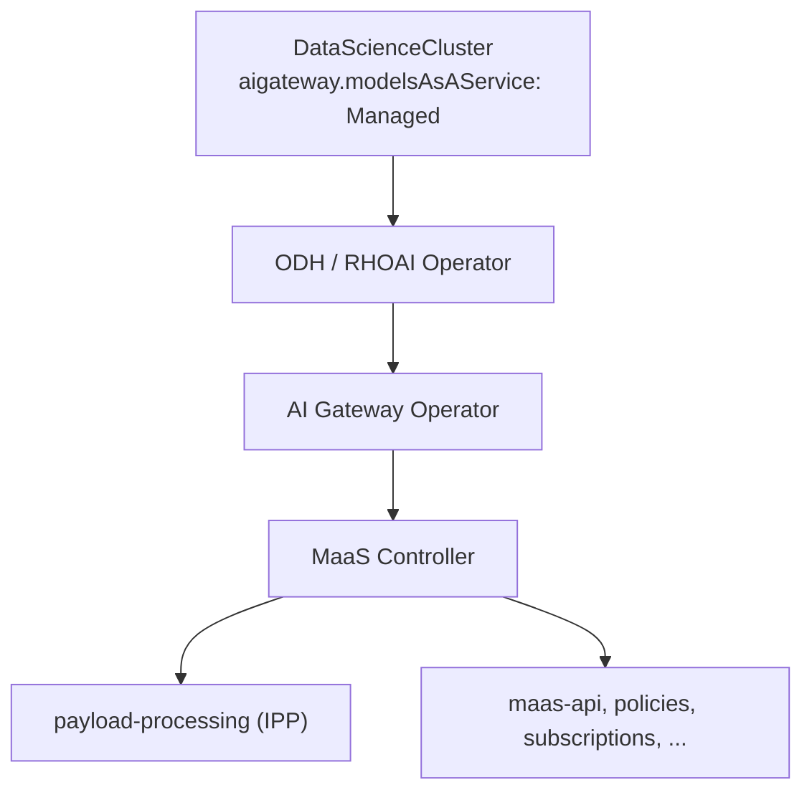
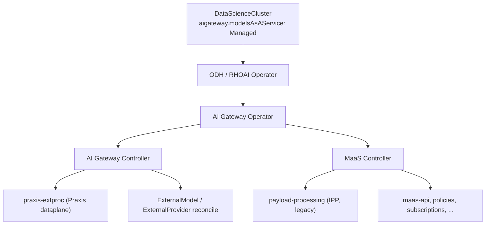

# ai-gateway-controller — Design

## Status

**Phase 1:** `make build` (tidy, lint, test, binary) passes clean, 94.7%
coverage on `pkg/render`. Not yet built into a released image, not yet
pushed to a remote, not yet wired end-to-end into a live
`ai-gateway-operator` reconcile (see "Out of scope").

**Phase 2 (EA2):** `ExternalModel` / `ExternalProvider` reconciliation and
multi-tenant fan-out — in progress.

## Purpose

`ai-gateway-controller` is the AI Gateway control-plane controller. Target
state (3.6): sibling of `maas-controller`, both deployed by
`ai-gateway-operator`:

```
ai-gateway-operator ──deploys──▶ ai-gateway-controller ──reconciles──▶ external models (control plane)
ai-gateway-operator ──deploys──▶ ai-gateway-controller ──installs──▶ praxis-extproc (dataplane)
ai-gateway-operator ──deploys──▶ maas-controller ──installs──▶ maas-api
```

This repo replaces the control-plane half of `payload-processing` (IPP):
watching `ExternalModel` / `ExternalProvider` and generating per-model
configuration. The dataplane half moves to **Praxis** (`praxis-extproc`).

Today `maas-controller` deploys the required infrastructure
(CRDs, Deployments, etc.) and the IPP repo watches `ExternalModel` /
`ExternalProvider`, doing both control-plane reconciliation and the ExtProc
dataplane. 3.5 ships only `maas-controller` + IPP; see
[Deployment architecture](#deployment-architecture).

**Phase 1 (implemented today)** vendors and installs `praxis-extproc`
manifests only.

**Phase 2 (EA2, in progress)** adds `ExternalModel` / `ExternalProvider` watch,
dynamic per-model config generation, and multi-tenant fan-out via
`MaasTenantConfig` / `AITenant` (see [Scope](#scope)).

## Deployment architecture

### Current architecture (3.5)



- **Operator chain:** `DataScienceCluster` (`aigateway.modelsAsAService: Managed`) → ODH/RHOAI operator → AI Gateway Operator → **`maas-controller` only**.
- **`ai-gateway-controller` is not deployed in 3.5.** ExtProc dataplane is **IPP** (`payload-processing`), owned entirely by MaaS.
- **`maas-controller` bootstraps infrastructure** (CRDs, Deployments, gateway policies, etc.).
- **IPP owns both control plane and dataplane for external models:**
  - Watches `ExternalModel` / `ExternalProvider` and reconciles per-model configuration.
  - Runs the ExtProc dataplane (Deployment, EnvoyFilter, plugins ConfigMap).
- **`AITenant` is a MaaS-owned object:**
  - `maas-controller` bootstraps `AITenant/models-as-a-service` on startup.
  - AITenant reconciler drives tenant namespace, `MaasTenantConfig`, maas-api, and gateway-scoped platform resources per tenant.
- **IPP is injected through MaaS tenant reconciliation:**
  - Tenant reconcile deploys `payload-processing` based on the owning `AITenant`.
  - No `AITenant` field to pick dataplane backend — IPP is always what gets installed.

### 3.6 architecture (target)



- **AI Gateway Operator deploys two sibling controllers:**
  - **`ai-gateway-controller`** — external-model control plane (watch + reconcile `ExternalModel` / `ExternalProvider`) and installs `praxis-extproc` (Praxis dataplane).
  - **`maas-controller`** — MaaS platform (maas-api, gateway policies, subscriptions, telemetry, infrastructure bootstrap).
- **Control-plane / dataplane split (replaces IPP's dual role):**
  - **`ai-gateway-controller`** — deployment and reconciling of external models (per-model config generation, formerly in IPP).
  - **Praxis (`praxis-extproc`)** — ExtProc dataplane only.
- **`AITenant` selects the dataplane backend per tenant (EA2 / Phase 2):**
  - New field (or equivalent) on `AITenant` to choose **Praxis** (`praxis-extproc`, via `ai-gateway-controller`) vs **IPP** (`payload-processing`, legacy MaaS path).
  - Required so 3.6 can support both backends during the Praxis migration.
- **Multi-tenancy works the same way it does today:**
  - `MaasTenantConfig` / `AITenant` fan-out drives per-tenant namespaces, gateway binding, and dataplane install — no change to the tenancy model, only which ExtProc backend is selected.
- **Split of responsibilities:**
  - **`ai-gateway-controller`** — external-model control plane, `praxis-extproc` install, per-tenant Praxis/IPP dataplane selection.
  - **`maas-controller`** — MaaS auth, rate limits, API keys, model refs, subscription/policy concerns under that tenant.

## Approach

`praxis-extproc`'s manifests live in a separate repo, so they need
cross-repo, commit-pinned vendoring (the pattern `ai-gateway-operator` uses
for `maas-controller`). But `praxis-extproc`'s `deploy/overlays/odh` ships
placeholder values (namespace, gateway name, route names) that must be
rewritten by whoever installs it — vendor-and-apply alone isn't enough; a
post-render step is required too.

This repo combines both: pinned-commit vendoring into
`config/manifests/praxis-extproc/`, then a lightweight `controller-runtime`
manager (no `opendatahub-operator/v2` dependency) that does kustomize build →
placeholder post-render → SSA apply, run once at startup and on a periodic
resync interval. There is no CR watch in Phase 1; all configuration
(namespace, gateway name) comes from command-line flags.

## Scope

### Phase 1 — `praxis-extproc` install (implemented)

- Vendor `deploy/overlays/odh` from `opendatahub-io/praxis-extproc@main` at a
  pinned commit (`hack/scripts/get-manifests.sh`) into
  `config/manifests/praxis-extproc/`, baked into the image via `Dockerfile`.
- A `controller-runtime`-based manager with no CR watch; reconcile runs once
  at startup and on `--resync-interval` (default 5m).
- Post-render step rewriting: target namespace, the `maas-default-gateway`
  placeholder, `PLACEHOLDER.maas-api-route.N` route names, and the
  `*.openshift-ingress.svc.cluster.local` FQDNs.
- SSA-apply of rendered resources with a dedicated field owner
  (`ai-gateway-controller`).
- PR/CI conventions — see [CONTRIBUTING.md](./CONTRIBUTING.md).

### Phase 2 — external models + multi-tenancy (EA2, in progress)

- `ExternalModel` / `ExternalProvider` watch and dynamic per-model config
  generation — full control-plane replacement for IPP (Praxis handles the
  dataplane). **Not** in `maas-controller` today; lives in IPP and moves here.
- Multi-tenant fan-out (`MaasTenantConfig` / `AITenant`) — same tenancy model
  as today (per-tenant namespace, gateway binding, and dataplane install).
  `AITenant` determines whether a tenant uses Praxis or IPP.

### Out of scope (explicitly deferred)
- Watching `AIGateway` (or any CR). Revisit once `AIGatewaySpec` gains a
  field relevant to this controller (today it only has `BatchGateway` and
  `ModelsAsAService` toggles).
- Wiring this repo into `ai-gateway-operator`'s live reconcile loop.
  `ai-gateway-operator` already vendors this repo's `config/self` (no
  `exclude_path` needed — see "Repo layout") and has manifest/image-param
  plumbing for it in `internal/controller/aigateway/aigateway.go`; whether
  that path is fully exercised end-to-end (RBAC sufficiency, an
  `AIGatewaySpec` toggle dedicated to this component rather than reusing
  `ModelsAsAService.ManagementState`) has not been verified from this repo's
  side and needs a real vendoring/deploy run to confirm.

## Dependencies

Phase 1 has no CR watch, so no cross-repo Go type imports (no dependency on
`ai-gateway-operator/api/...` or `models-as-a-service/...`). Phase 2 will
add watches for `ExternalModel`, `ExternalProvider`, and tenant-scoped CRs.
Today only:

- `sigs.k8s.io/controller-runtime` (client + manager, leader election, health
  endpoints)
- `sigs.k8s.io/kustomize/api` (`krusty`) for kustomize build
- Standard `k8s.io/api`, `k8s.io/apimachinery`, `k8s.io/client-go`

## Repo layout

```
ai-gateway-controller/
├── cmd/manager/main.go                  # flags, manager bootstrap, run-once + resync loop
├── pkg/render/
│   ├── kustomize.go                     # Build(): krusty kustomize build -> []unstructured.Unstructured
│   ├── postrender.go                    # PostRender(): placeholder substitution + namespace defaulting
│   ├── apply.go                         # Apply(): SSA patch, field owner "ai-gateway-controller"
│   └── installer.go                     # Installer: manager.Runnable, run-once + ResyncInterval ticker
├── config/manifests/praxis-extproc/     # vendored (committed) praxis-extproc overlay; Build() points here
├── config/self/{rbac,manager,default}/  # this repo's own deploy manifest (SA/ClusterRole/Deployment),
│                                         # namespace opendatahub. Kept as a sibling of config/manifests/
│                                         # (not nested under it) so ai-gateway-operator can vendor exactly
│                                         # config/self with no exclude_path needed.
├── hack/scripts/get-manifests.sh        # pinned-commit vendoring for config/manifests/praxis-extproc/
├── Dockerfile                           # single-repo build context
├── Makefile, tools.mk                   # build/test/lint/tidy/get-manifests/build-image targets
└── DESIGN.md                            # this file
```

### Flags (`cmd/manager/main.go`)

| Flag | Default | Purpose |
|---|---|---|
| `--namespace` | `openshift-ingress` | Where resources are installed; replaces the `openshift-ingress` placeholder |
| `--gateway-name` | `maas-default-gateway` | Replaces the `maas-default-gateway` placeholder |
| `--image` | `quay.io/opendatahub/odh-praxis-extproc:odh-stable` | Replaces the `praxis-extproc:dev` placeholder image |
| `--manifest-path` | `/config/manifests/praxis-extproc/overlays/odh` | kustomize entrypoint (matches the Dockerfile `COPY` destination) |
| `--maas-api-route-name` | `maas-api-route` | Best-effort; exact fidelity depends on maas-api's real HTTPRoute name and Istio's route-naming scheme |
| `--resync-interval` | `5m` | Re-apply cadence; the only trigger besides restart (no CR watch) |
| `--leader-elect` | `false` | Enable when running multiple replicas |
| `--metrics-bind-address`, `--health-probe-bind-address` | `:8080`, `:8081` | Standard controller-runtime endpoints |

## Tooling & conventions

See [CONTRIBUTING.md](./CONTRIBUTING.md) for what CI enforces. A few
decisions worth calling out here because they're not obvious from the config
alone:

- Arithmetic safety (overflow/underflow, unsafe numeric casts) is a
  code-review responsibility, not a lint — there is no mature Go tool for
  this.
- `go fix` modernizer suggestions are report-only (`make modernize`), not a
  CI gate.
- KAL (`kube-api-linter`) and `crdify` are not adopted — both only apply once
  this repo defines its own CRD types, which it doesn't today.
- Image publishing goes through Konflux (`.tekton/` PipelineRuns), not a
  GitHub Actions release workflow.

## Open questions (non-blocking, tracked)

- Whether `payload-processing-reader`'s RBAC needs to grow once more Praxis
  filters land (today's rules cover exactly the `request_id` /
  `model_to_header` filter chains in use).
- Whether/when to add a real `For(&AIGateway{})` watch once its spec gains a
  relevant field.
- `Params.MaaSAPIRouteName`'s fidelity is unverified against a live
  maas-api `HTTPRoute` — revisit once this controller integrates with one.
- End-to-end verification of the `ai-gateway-operator` wiring described in
  "Out of scope" (RBAC sufficiency, dedicated `AIGatewaySpec` toggle).
- This repo has no git remote yet, so none of `.github/workflows/*` have
  actually executed — they're believed correct against the Makefile targets
  but unverified in GitHub Actions.
