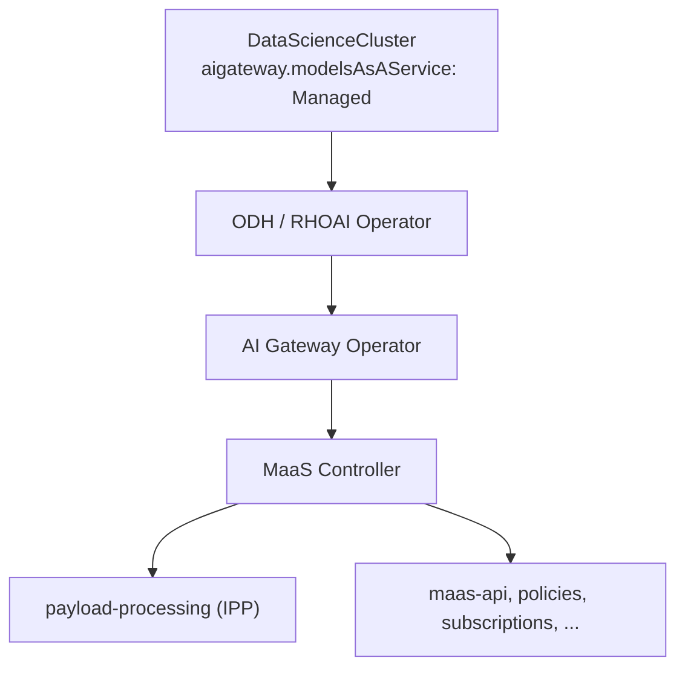
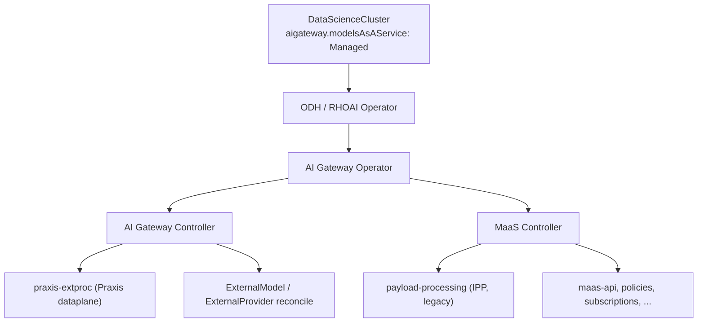

# ai-gateway-controller — Design

Architecture decisions are maintained in the Open Data Hub ADR repository.
The External Model/Praxis two-plane decision is tracked as
[ODH-ADR-MS-0005](https://github.com/opendatahub-io/architecture-decision-records/pull/165),
so this implementation repository does not carry a second authoritative copy.

## Status

**Phase 1:** `make build` (tidy, lint, test, binary) passes clean. Not yet
built into a released image, not yet pushed to a remote, not yet wired
end-to-end into a live `ai-gateway-operator` reconcile (see "Out of scope").

**Phase 2 (EA2):** the multi-tenant Praxis-vs-IPP fan-out and ExternalModel
control plane are implemented. `pkg/tenant` primarily watches
`MaasTenantConfig` — mirroring
maas-controller's own `TenantReconciler` — and, for every tenant whose
`metadata.annotations["maas.opendatahub.io/payload-processing-type"]` is
`"praxis"`, renders, SSA-applies, and (on switch-away or deletion) cleans
up a per-tenant copy of the vendored `praxis-extproc` manifests — replacing
Phase 1's single unconditional global install. `pkg/controller` reconciles
`ExternalModel` / `ExternalProvider` resources into the tenant-local ExtProc
overlay, credential projections, and Envoy-owned provider transport.

## Purpose

`ai-gateway-controller` is the AI Gateway control-plane controller. Target
state (3.6): sibling of `maas-controller`, both deployed by
`ai-gateway-operator`:

```
ai-gateway-operator ──deploys──▶ ai-gateway-controller ──reconciles──▶ external models (control plane)
ai-gateway-operator ──deploys──▶ ai-gateway-controller ──installs──▶ praxis-extproc (dataplane)
ai-gateway-operator ──deploys──▶ maas-controller ──installs──▶ maas-api
```

This repo replaces the control-plane half of `payload-processing` (IPP):
watching `ExternalModel` / `ExternalProvider` and generating per-model
configuration. The dataplane half moves to **Praxis** (`praxis-extproc`).

Today `maas-controller` deploys the required infrastructure
(CRDs, Deployments, etc.) and the IPP repo watches `ExternalModel` /
`ExternalProvider`, doing both control-plane reconciliation and the ExtProc
dataplane. 3.5 ships only `maas-controller` + IPP; see
[Deployment architecture](#deployment-architecture).

**Phase 1 (implemented today)** vendors and installs `praxis-extproc`
manifests only.

**Phase 2 (EA2, implemented)** primarily watches `MaasTenantConfig` and, per
opted-in tenant, applies and cleans up its own per-tenant ExtProc resources.
It also watches `ExternalModel` / `ExternalProvider` and publishes dynamic
per-model routing, provider transport, and reference-only credentials.

## Deployment architecture

### Current architecture (3.5)



- **Operator chain:** `DataScienceCluster` (`aigateway.modelsAsAService: Managed`) → ODH/RHOAI operator → AI Gateway Operator → **`maas-controller` only**.
- **`ai-gateway-controller` is not deployed in 3.5.** ExtProc dataplane is **IPP** (`payload-processing`), owned entirely by MaaS.
- **`maas-controller` bootstraps infrastructure** (CRDs, Deployments, gateway policies, etc.).
- **IPP owns both control plane and dataplane for external models:**
  - Watches `ExternalModel` / `ExternalProvider` and reconciles per-model configuration.
  - Runs the ExtProc dataplane (Deployment, EnvoyFilter, plugins ConfigMap).
- **`AITenant` is a MaaS-owned object:**
  - `maas-controller` bootstraps `AITenant/models-as-a-service` on startup.
  - AITenant reconciler drives tenant namespace, `MaasTenantConfig`, maas-api, and gateway-scoped platform resources per tenant.
- **IPP is injected through MaaS tenant reconciliation:**
  - Tenant reconcile deploys `payload-processing` based on the owning `AITenant`.
  - No `AITenant` field to pick dataplane backend — IPP is always what gets installed.

### 3.6 architecture (target)



- **AI Gateway Operator deploys two sibling controllers:**
  - **`ai-gateway-controller`** — external-model control plane (watch + reconcile `ExternalModel` / `ExternalProvider`) and installs `praxis-extproc` (Praxis dataplane).
  - **`maas-controller`** — MaaS platform (maas-api, gateway policies, subscriptions, telemetry, infrastructure bootstrap).
- **Control-plane / dataplane split (replaces IPP's dual role):**
  - **`ai-gateway-controller`** — deployment and reconciling of external models (per-model config generation, formerly in IPP).
  - **Praxis (`praxis-extproc`)** — ExtProc dataplane only.
- **`MaasTenantConfig` selects the dataplane backend per tenant (EA2 / Phase 2, implemented):**
  - `MaasTenantConfig.metadata.annotations["maas.opendatahub.io/payload-processing-type"] == "praxis"` chooses **Praxis** (via `ai-gateway-controller`'s `pkg/tenant`) vs **IPP** (`payload-processing`, legacy MaaS path, the default when the annotation is absent/other). This annotation lives only on `MaasTenantConfig` — it is never mirrored to/from `AITenant` — so both controllers always read the same single source of truth from the same object they both watch.
  - Lets 3.6 support both backends during the Praxis migration, one tenant at a time, with a race-free handoff (see [Approach](#approach)) when a tenant swaps backends.
- **Multi-tenancy works the same way it does today:**
  - `MaasTenantConfig` / `AITenant` fan-out drives per-tenant namespaces, gateway binding, and dataplane install — no change to the tenancy model, only which ExtProc backend is selected.
- **Split of responsibilities:**
  - **`ai-gateway-controller`** — external-model control plane, `praxis-extproc` install, per-tenant Praxis/IPP dataplane selection.
  - **`maas-controller`** — MaaS auth, rate limits, API keys, model refs, subscription/policy concerns under that tenant.
- **Lifecycle toggle (decided):** `ai-gateway-controller` shares
  `AIGateway.spec.modelsAsAService.managementState` with `maas-controller`.
  There is no dedicated `AIGatewaySpec` toggle for this component: when MaaS
  is `Managed`, `ai-gateway-operator` deploys both siblings; when MaaS is
  `Removed`, both tear down (with the same teardown-grace-period window
  `maas-controller` uses, since praxis-extproc may still be serving traffic
  MaaS's own teardown depends on). `ModelsAsAServiceReady` reflects both
  Deployments.

## Approach

`praxis-extproc`'s manifests live in a separate repo, so they need
cross-repo, commit-pinned vendoring (the pattern `ai-gateway-operator` uses
for `maas-controller`). But `praxis-extproc`'s `deploy/overlays/odh` ships
placeholder values (namespace, gateway name, route names, and fixed resource
names) that must be rewritten by whoever installs it — vendor-and-apply
alone isn't enough; a post-render step is required too.

This repo combines both: pinned-commit vendoring into
`config/manifests/praxis-extproc/`, then a lightweight `controller-runtime`
manager (no `opendatahub-operator/v2` dependency) that primarily watches
`MaasTenantConfig` (`pkg/tenant`) — mirroring maas-controller's own
`TenantReconciler`, which watches the same object — and, for every tenant
whose payload-processing annotation is `praxis`, does kustomize build →
placeholder post-render → per-tenant rename/patch → SSA apply into that
tenant's Gateway namespace. Both controllers watching the same primary
object (rather than `ai-gateway-controller` watching `AITenant` while
`maas-controller` watches `MaasTenantConfig`) means a backend-selection
write is a single watch event both sides observe together, with no
cross-object propagation lag between them.

`status.gatewayRef` and `status.phase` still live on `AITenant`, not
`MaasTenantConfig`, so this controller also Gets a tenant's owning `AITenant`
(via the `aitenant-name`/`aitenant-namespace` annotations maas-controller's
own `AITenantReconciler` already stamps onto every AITenant-managed
`MaasTenantConfig`) and gates apply on `status.phase == "Active"` there, so
nothing is applied before maas-controller has actually validated the
Gateway and finished bootstrapping the tenant. Both CRDs are read as
`unstructured.Unstructured` against hardcoded `schema.GroupVersionKind`s
rather than by importing `models-as-a-service/maas-controller`'s Go types:
that module's `go.mod` pulls in `kserve`, `knative`, `KEDA`, `openshift/api`,
and more, none of which this controller needs to keep its own dependency
graph minimal.

A `PraxisCleanupFinalizer` on the `MaasTenantConfig` (not `AITenant`)
guarantees a chance to delete what was applied when a tenant switches away
from `praxis` or the `MaasTenantConfig` is deleted (SSA only ever upserts
the current render set, it never deletes what falls out of it) — mirroring
maas-controller's own `tenant-cleanup` finalizer pattern on the same object.
Putting the finalizer on `MaasTenantConfig` rather than `AITenant` is
deliberate: maas-controller's own `AITenantReconciler.deleteTenantConfig`
already blocks `AITenant` deletion until `MaasTenantConfig` — and therefore
every finalizer on it, including this one — is fully gone, so `AITenant`
deletion ordering falls out of that existing mechanism for free, with no
separate coordination needed. `DeletionTimeout` bounds how long cleanup
retries before force-removing the finalizer without confirming cleanup
succeeded, same as before.

### Payload-processing backend swap handshake

Legacy IPP (maas-controller) and Praxis (this repo) share the same
Gateway-namespace resource names (`payload-processing`,
`payload-pre-processing`, etc.), so switching a tenant's
`payload-processing-type` annotation hands the same names off between two
independent controllers. Without coordination this is racy — see
`maas-controller`'s `tenantreconcile.AnnotationPayloadProcessingStatus`
doc comment for the full state machine this mirrors. In short:

- The status annotation (`maas.opendatahub.io/payload-processing-status`)
  lives only on `MaasTenantConfig` and has three meaningful states:
  - `cleanup-complete`: clear to claim. The party currently selected by
    `payload-processing-type` may CAS-claim and start deploying.
  - `steady`: praxis owns the dataplane and may resume/apply. Legacy must
    wait until praxis switch-off writes `cleanup-complete`.
  - **absent**: legacy steady when legacy is selected (existing tenants are
    assumed to run legacy IPP); blocked when praxis is selected (wait for
    legacy cleanup). Brand-new tenants are seeded with `cleanup-complete`
    at `MaasTenantConfig` creation time so their first deploy is never
    blocked by absent.
- Claiming for praxis (`EnsurePraxisMayDeploy` / `claimPraxisSteady`) writes
  `steady` via an optimistic-concurrency `Update`. Legacy's mirror claim
  deletes the annotation back to absent. Concurrent claims on the same
  `cleanup-complete` value: only one `Update` wins; the other observes
  `Conflict` and re-evaluates.
- Status itself is the durable claim — apply failures after a successful
  claim resume on the next reconcile because status is already `steady`.
- After a full, successful switch-off cleanup (`Reconciler.cleanup`), this
  controller writes `cleanup-complete` (`MarkPayloadProcessingCleanupComplete`)
  so maas-controller may claim to absent and (re)deploy legacy IPP.

## Scope

### Phase 1 — `praxis-extproc` install (implemented)

- Vendor `deploy/overlays/odh` from `opendatahub-io/praxis-extproc@main` at a
  pinned commit (`hack/scripts/get-manifests.sh`) into
  `config/manifests/praxis-extproc/`, baked into the image via `Dockerfile`.
- `pkg/render`: kustomize build, placeholder post-render (target namespace,
  the `maas-default-gateway` placeholder, `PLACEHOLDER.maas-api-route.N`
  route names, `*.openshift-ingress.svc.cluster.local` FQDNs), and SSA-apply
  with a dedicated field owner (`ai-gateway-controller`). These primitives
  are tenant-agnostic; `pkg/tenant` (Phase 2) is what makes them per-tenant.
- PR/CI conventions — see [CONTRIBUTING.md](./CONTRIBUTING.md).

### Phase 2 — multi-tenancy + external models (EA2, implemented)

- **Implemented:** `pkg/tenant` primarily watches `MaasTenantConfig`
  (`maas.opendatahub.io/v1alpha1`) — mirroring maas-controller's own
  `TenantReconciler` — and, for every tenant whose
  `maas.opendatahub.io/payload-processing-type` annotation is `praxis`,
  renders and applies a dedicated, per-tenant-named copy of the
  praxis-extproc resources (`{base}-{tenantID}`, the default/legacy tenant
  keeps the unsuffixed names) into that tenant's owning `AITenant`'s
  `status.gatewayRef` namespace, once that `AITenant`'s `status.phase` is
  `Active`. A secondary `AITenant` watch reacts to gatewayRef/phase changes
  that a `MaasTenantConfig`-only watch would miss. Tenants that don't opt in
  (absent/empty/other) are untouched — `maas-controller`'s own
  `TenantReconciler` owns their IPP deployment. There is no
  unconditional/default install anymore: a tenant gets praxis-extproc only
  by opting in via its `MaasTenantConfig`.
  `PraxisCleanupFinalizer` (on `MaasTenantConfig`) deletes a tenant's
  praxis-extproc resources when it switches away from `praxis` or its
  `MaasTenantConfig` is deleted; `--deletion-timeout` bounds how long that
  retries before force-removing the finalizer without confirmed cleanup.
  This controller does not write any `AITenant` at all (status or
  otherwise) — maas-controller's own `AITenant` reconciler owns it today.
- `pkg/controller` watches `ExternalModel` / `ExternalProvider` and publishes
  the content-addressed overlay, provider routes and transport, and Secret
  references. Tenant-local ExtProc runs `intelligent_route` and
  `credential_inject`; Envoy performs route reselection and the provider hop.

### Out of scope (explicitly deferred)
- Watching `AIGateway` (or any CR) from this controller. Lifecycle is
  owned by `ai-gateway-operator` via the shared
  `ModelsAsAService.ManagementState` toggle (see [3.6 architecture](#36-architecture-target));
  this controller only needs its `MaasTenantConfig` and `AITenant` watches.
- End-to-end verification of the `ai-gateway-operator` wiring described in
  [Repo layout](#repo-layout) (RBAC sufficiency, image-param injection,
  deploy/teardown alongside `maas-controller` under the shared MaaS toggle).
  `ai-gateway-operator` already vendors this repo's `config/self` (no
  `exclude_path` needed) and appends it when
  `ModelsAsAService.ManagementState == Managed` in
  `internal/controller/aigateway/aigateway.go`; a real vendoring/deploy run
  from this repo's side has not been confirmed yet.

## Dependencies

No cross-repo Go type imports (no dependency on `ai-gateway-operator/api/...`
or `models-as-a-service/...`): `pkg/tenant` watches `MaasTenantConfig` and
`AITenant` via `unstructured.Unstructured` + hardcoded
`schema.GroupVersionKind`s instead (see "Approach"). `ExternalModel` /
`ExternalProvider` watches, if they need
typed access to CRDs this repo doesn't already define, should default to the
same pattern unless a concrete need for generated deepcopy/defaulting
justifies revisiting it. Today only:

- `sigs.k8s.io/controller-runtime` (client + manager, leader election, health
  endpoints)
- `sigs.k8s.io/kustomize/api` (`krusty`) for kustomize build
- Standard `k8s.io/api`, `k8s.io/apimachinery`, `k8s.io/client-go`

## Repo layout

```
ai-gateway-controller/
├── cmd/manager/main.go                  # flags, manager bootstrap, registers pkg/tenant.Reconciler
├── pkg/render/
│   ├── kustomize.go                     # Build(): krusty kustomize build -> []unstructured.Unstructured
│   ├── postrender.go                    # PostRender(): placeholder substitution + namespace defaulting
│   └── apply.go                         # Apply(): SSA patch, field owner "ai-gateway-controller"
├── pkg/tenant/                          # per-tenant MaasTenantConfig -> praxis-extproc fan-out (Phase 2)
│   ├── constants.go, naming.go          # MaasTenantConfigGVK, AITenantGVK, base resource names, "{base}-{tenantID}" naming
│   ├── maastenantconfig.go              # unstructured MaasTenantConfig field accessors (no Go type import)
│   ├── aitenant.go                      # unstructured AITenant field accessors (status.gatewayRef / status.phase only)
│   ├── migration.go                     # payload-processing backend swap handshake (existence-check + CAS claim)
│   ├── ownership.go                     # field-manager/label ownership check for cleanup deletes
│   ├── rename.go                        # Rename(): per-tenant resource rename + internal-reference patch
│   └── reconciler.go                    # Reconciler: primarily watches MaasTenantConfig, apply/cleanup + PraxisCleanupFinalizer
├── config/manifests/praxis-extproc/     # exact pinned upstream praxis-extproc manifests
├── config/manifests/external-model/    # controller-owned Kustomize composition and ExternalModel filters
├── config/self/{rbac,manager,default}/  # this repo's own deploy manifest (SA/ClusterRole/Deployment),
│                                         # namespace opendatahub. Kept as a sibling of config/manifests/
│                                         # (not nested under it) so ai-gateway-operator can vendor exactly
│                                         # config/self with no exclude_path needed.
├── hack/scripts/get-manifests.sh        # pinned-commit vendoring for config/manifests/praxis-extproc/
├── Dockerfile                           # single-repo build context
├── Makefile, tools.mk                   # build/test/lint/tidy/get-manifests/build-image targets
└── DESIGN.md                            # this file
```

### Flags (`cmd/manager/main.go`)

| Flag | Default | Purpose |
|---|---|---|
| `--image` | `quay.io/opendatahub/odh-praxis-extproc:odh-stable` | Replaces the `praxis-extproc:dev` placeholder image |
| `--manifest-path` | `/config/manifests/external-model/overlays/odh` | controller-owned kustomize entrypoint composing pinned upstream manifests and ExternalModel patches |
| `--maas-api-route-name` | `maas-api-route` | Base name; suffixed per tenant like every other resource. Best-effort — exact fidelity depends on maas-api's real HTTPRoute name and Istio's route-naming scheme |
| `--resync-interval` | `5m` | `RequeueAfter` once a tenant's resources are applied, so drift gets corrected periodically even without a new `AITenant` watch event |
| `--deletion-timeout` | `10m` | Maximum time to retry praxis-extproc cleanup for a tenant before force-removing `PraxisCleanupFinalizer` without confirming cleanup succeeded; `0` disables the timeout and retries indefinitely |
| `--leader-elect` | `false` | Enable when running multiple replicas |
| `--metrics-bind-address`, `--health-probe-bind-address` | `:8080`, `:8081` | Standard controller-runtime endpoints |

## Tooling & conventions

See [CONTRIBUTING.md](./CONTRIBUTING.md) for what CI enforces. A few
decisions worth calling out here because they're not obvious from the config
alone:

- Arithmetic safety (overflow/underflow, unsafe numeric casts) is a
  code-review responsibility, not a lint — there is no mature Go tool for
  this.
- `go fix` modernizer suggestions are report-only (`make modernize`), not a
  CI gate.
- KAL (`kube-api-linter`) and `crdify` are not adopted — both only apply once
  this repo defines its own CRD types, which it doesn't today.
- Image publishing goes through Konflux (`.tekton/` PipelineRuns), not a
  GitHub Actions release workflow.

## Open questions (non-blocking, tracked)

- `pkg/tenant.Reconciler` does not write any status
  (condition/phase) on `MaasTenantConfig` or `AITenant` reflecting whether
  the per-tenant praxis-extproc install succeeded — maas-controller's own
  reconcilers own `status` on both objects today, so this would need a
  careful merge strategy, not a blind `Status().Update()`.
- A computed per-tenant resource name over 63 characters (possible even
  within the CRD's 41-character `AITenant` name limit, since that limit
  was sized against maas-controller's own longest base name, not
  praxis-extproc's longer `payload-processing-plugins`) is logged and
  skipped rather than retried; revisit if this needs surfacing more
  visibly (event, status, metric) once status is written.
- Whether `payload-processing-reader`'s RBAC needs to grow once more Praxis
  filters land (today's rules cover exactly the `request_id` /
  `model_to_header` filter chains in use).
- `Params.MaaSAPIRouteName`'s fidelity is unverified against a live
  maas-api `HTTPRoute` — revisit once this controller integrates with one.
- End-to-end verification of the `ai-gateway-operator` wiring described in
  "Out of scope" (RBAC sufficiency, shared-MaaS-toggle deploy/teardown).
- This repo has no git remote yet, so none of `.github/workflows/*` have
  actually executed — they're believed correct against the Makefile targets
  but unverified in GitHub Actions.
