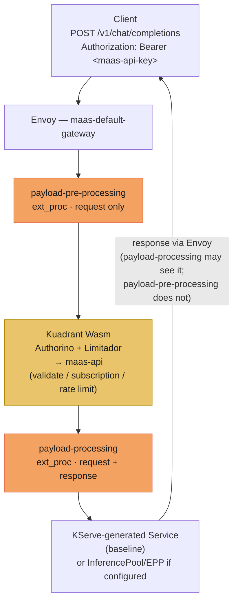
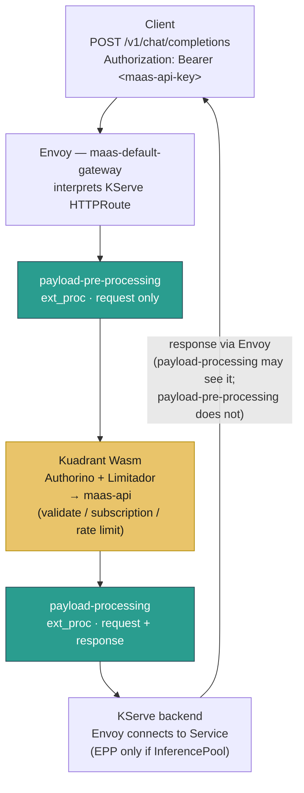
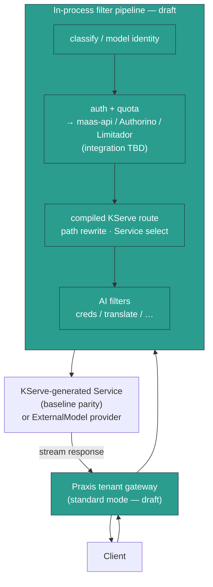

# Praxis dataplane evolution

How the MaaS AI Gateway dataplane evolves from today's Envoy + ExtProc stack
toward Praxis. This is a request-path map, not a deployment ADR — see
[DESIGN.md](../DESIGN.md) for operator / controller ownership.

Sources:

- [Praxis evolution (gist)](https://gist.github.com/aslakknutsen/ff7f9a7fc206b0706974a7756054e56d)
- [Praxis/MaaS V3 datapath research spike](https://github.com/nerdalert/praxis-research-spikes/blob/main/research/praxis-maas-v3-data-path-spike.md)
  ([PR #57 discussion](https://github.com/opendatahub-io/ai-gateway-controller/pull/57))

## Two dataplane modes

| Mode | Role of Praxis | Who opens the upstream connection | Envoy / Istio on path? |
| --- | --- | --- | --- |
| **Gateway mode** (today → 3.6) | ExtProc side-call from Envoy (`payload-pre-processing` / `payload-processing`) | **Envoy** (after HTTPRoute match) | Yes — Envoy is the L7 gateway |
| **Standard mode** (post-3.6 draft) | Tenant-facing HTTP/TLS gateway; AI filters run in-process | **Praxis** (compiled KServe / ExternalModel routes) | No — Envoy/Istio not on the inference path |

Gateway mode keeps ExtProc compatibility with the existing Envoy deployment.
Standard mode is the eventual even-swap dataplane validated in the research
spike; it is still a draft and likely to change.

## Routing baseline vs optional scheduling

**Baseline MaaS / KServe path (parity target):** KServe generates an
`HTTPRoute` whose `backendRef` is the **model-serving Service**. Ordinary MaaS
inference does **not** require EPP or an InferencePool.

| Path | Backend | When |
| --- | --- | --- |
| **KServe Service routing** | Generated Service for an ordinary `LLMInferenceService` | Default / initial parity requirement |
| **InferencePool + EPP** | Scheduler picks a ready endpoint | Optional extension when a route uses an InferencePool backend |

EPP is **not** universally part of the MaaS path. In Gateway mode it stays
exactly as today when present. In standard mode, InferencePool/EPP support is
**separate future work** if that deployment shape is needed — not part of the
initial Service-routing parity.

## Color key (Gateway-mode filter diagrams)

| Color | Meaning |
| --- | --- |
| Orange | IPP-backed `payload-*` filter |
| Teal | Praxis-backed `payload-*` filter |
| Gold | Kuadrant (Authorino + Limitador → **maas-api**) — same pre-3.6 and 3.6 |

---

## Stages at a glance

| Stage | Mode | Payload filters | Auth / rate limit | Upstream selection |
| --- | --- | --- | --- | --- |
| Current (pre-3.6) | Gateway | IPP ExtProc | Kuadrant → maas-api | Envoy + KServe HTTPRoute → Service (EPP only if InferencePool) |
| Praxis for 3.6 | Gateway | Praxis ExtProc (same filter names) | Kuadrant → maas-api (same) | Same as current |
| Post 3.6 (draft) | Standard | In-process Praxis | Draft (adapters / fold-in TBD) | Controller compiles KServe HTTPRoute; Praxis dials Service |

---

## Current architecture (Gateway mode, IPP)

Envoy owns the client connection and the final hop to the KServe Service (or
optional EPP-selected endpoint). IPP runs as ExtProc.

**Filter roles:**

1. **payload-pre-processing** — read body `model`, set `X-Gateway-Model-Name`
   (enough for model-scoped auth).
2. **Kuadrant** — Authorino + Limitador; calls **maas-api** for API-key
   validate / subscription select (and optional rate limit); inject
   `x-maas-*`; strip/replace client `Authorization`.
3. **payload-processing** — strip client/maas creds for upstream; rewrite
   `publishers/...` model when needed; response-path hooks as configured.
4. **Envoy** — matches the KServe-generated HTTPRoute and connects to the
   selected backend (Service by default).

---

## Praxis for 3.6 (Gateway mode)

Same Envoy filter **names and order**. Only the ExtProc implementation
switches from IPP to Praxis. Kuadrant → maas-api is unchanged.

**3.6 request path:** Envoy interprets the KServe HTTPRoute → Praxis runs
through ExtProc → Envoy connects to the selected KServe backend (Service, or
EPP only when that route uses an InferencePool).

**3.6 delta:** orange (IPP) → teal (Praxis) for the two payload filters.
Auth/RL path unchanged. Routing/scheduling semantics unchanged.

---

## Post 3.6 — standard mode (initial draft — likely to change)

> **Draft only.** Direction of travel from the research spike, not a
> committed product design. Auth/quota integration and tokenomics remain open.

**Standard-mode idea:** the AI Gateway controller compiles the applicable
KServe-generated HTTPRoute into **native Praxis configuration**. Praxis is the
tenant-facing gateway and opens the connection to the generated KServe Service
(or ExternalModel provider) **without Envoy or Istio** on the inference path.
There is no standalone ExtProc hop — AI filters run in-process.

Spike-validated shape (PoC adapters, not production auth):

`Client → Praxis → auth/quota adapter → compiled KServe route → KServe Service → model runtime → Praxis → Client`

**Not in the initial standard-mode parity cut:** InferencePool / EPP. That
remains optional later work if scheduler-enabled routes must work without
Envoy.

### KServe behavior that must stay equivalent

Across Gateway → standard mode, preserve at least:

- route matching (correct HTTPRoute rule / backendRef)
- path rewriting from the KServe-generated route
- model-name rewriting (MaaS publisher model → backend identity)
- Service namespace and port selection
- streaming (JSON / SSE), cancellation, upstream failure handling
- readiness / status truthfulness (no false-positive Ready)
- fail-closed auth, entitlement, and quota (deny before backend contact)

### Spike caveats (do not over-read the PoC)

- Auth/quota used a **temporary** Authorino/Limitador adapter — disposable
  plumbing, not the proposed production design.
- Final authorization, rate-limit, and token-accounting depend on the Praxis
  tokenomics decision and compatibility with existing MaaS deployments.
- See the [research spike](https://github.com/nerdalert/praxis-research-spikes/blob/main/research/praxis-maas-v3-data-path-spike.md)
  for what was validated (Service + ExternalModel on one listener, streaming,
  fail-closed denials, multi-replica shared quota state, hot provider updates).

---

## How this relates to this repository

| Concern | Gateway mode (≤ 3.6) | Standard mode (draft) |
| --- | --- | --- |
| ExtProc install + ExternalModel control plane | `ai-gateway-controller` swaps IPP → Praxis ExtProc | Compile Gateway / KServe / ExternalModel intent into Praxis runtime config |
| Auth / subscription / API keys | Kuadrant → Authorino → **maas-api** | Retain MaaS contracts; transport/adapters TBD |
| Rate limits | Limitador via Kuadrant | Same — product design open |
| AI payload processing | ExtProc `payload-*` filters | In-process Praxis AI filters |
| KServe Service routing | Envoy matches HTTPRoute, dials Service | Controller compiles route; Praxis dials Service |
| InferencePool / EPP | Unchanged when present; not required for baseline | Separate future work — not initial parity |

For control-plane deployment topology (operators, tenant fan-out, IPP vs
Praxis selection), see [DESIGN.md](../DESIGN.md).
